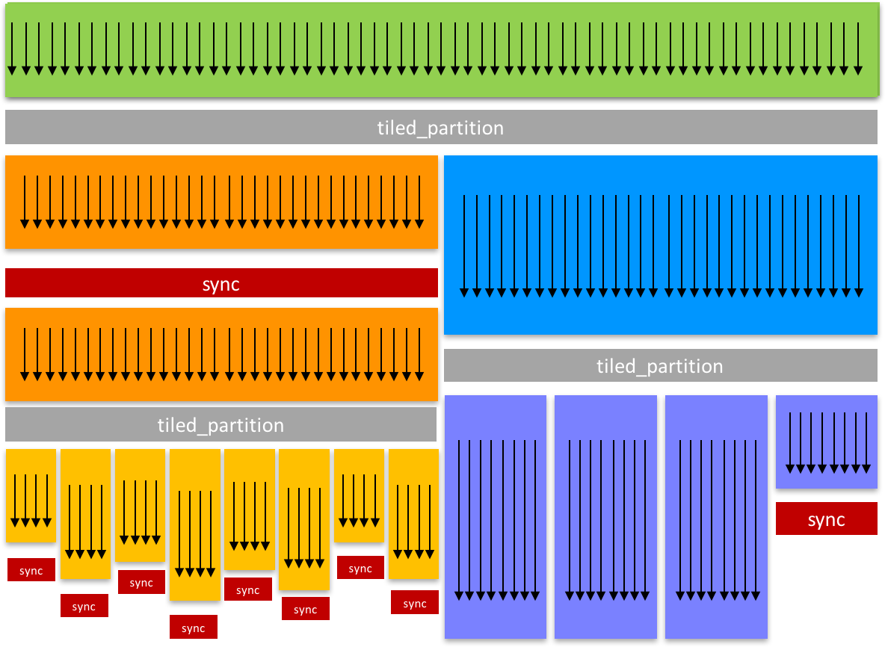
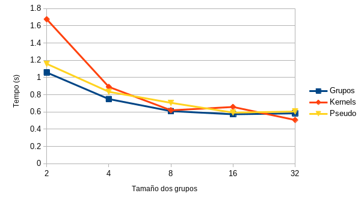
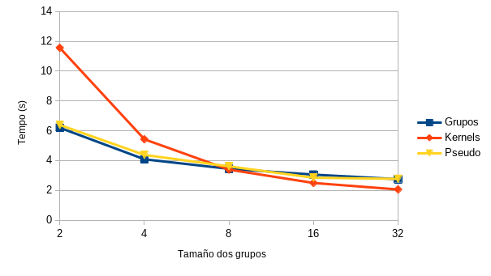

\newpage
\pagenumbering{arabic}

# Introdución

Introducidos en CUDA 9.0 no 2017, os grupos cooperativos son unha ferramenta que permite ós programadores agrupar fíos dentro dun bloque ou bloques dentro dun *grid* dun xeito máis flexible e dinámico [@coop-groups-blog].

Nos algoritmos paralelos eficientes compártense datos entre fíos para realizar operacións colectivas e, para partillar estes datos, é preciso realizar sincronizacións para evitar lecturas ou escrituras incorrectas.

Previamente, para compartir datos entre fíos ou ben podía facerse a nivel de *warp* usando as chamadas *shuffle instructions* presentadas co lanzamento da arquitectura Kepler no 2012 [@kepler-shuffle] ou a nivel de bloque usando a memoria compartida, que implica sincronizar tódolos fíos do bloque, aínda que parte deles non necesiten eses datos, xerando ineficiencias no programa.

<!-- Previamente, para compartir datos entre os fíos dun bloque existían dúas opcións: se era a nivel de *warp*, a partir do lanzamento da arquitectura Kepler no 2012, foi posible usar as chamadas *shuffle instructions* [@kepler-shuffle]; se era a calquera outro nivel dentro do bloque, a única opción era usar a memoria compartida que, se ben rápida, implicaba certo custo temporal entre a escritura do valor a compartir e a súa lectura polos demais fíos. -->

<!-- Ademais, usar a memoria compartida para enviar datos entre fíos dun bloque implica a maior parte das veces unha posterior sincronización chamando a `__syncthreads()`, unha barreira que obriga a tódolos fíos a agardar ó resto antes de poder continuar, incluso cando os datos só son necesarios para un subgrupo de fíos, o que dá lugar a unha perda de eficiencia no programa. -->

Por isto, e pola necesidade de Nvidia de mellorar a eficacia e flexibilidade da súa arquitectura e linguaxe de programación, naceu o concepto de grupos cooperativos, que permiten agrupar fíos e sincronizalos sen implicar ó resto do bloque. Aínda que antes de falar deles é preciso coñecer ben a estrutura dun *kernel* en CUDA, isto é, a xerarquía na que se distribúen os fíos dentro del.

# Breve resumo da xerarquía de CUDA

O modelo de programación de CUDA ten dúas xerarquías propias: a de memoria (figura \ref{cudamemhier}), en xeral similar á de calquera outra arquitectura, con distintos niveis de memoria rápida local a certo subgrupo de fíos (como unha caché) e unha memoria global máis grande e máis lenta, pero con certas diferenzas con respecto a varios dos seus conceptos e os nomes que lles dá; e a de fíos (figura \ref{cudathreadhier}), que é a que máis nos interesa coñecer neste caso.

![Xerarquía de memoria de CUDA [@cuda-mem-hier].](./imgs/cudamemoryhierarchy.png){ width=70% #cudamemhier }

![Xerarquía de fíos de CUDA [@thread-block-heur].](./imgs/cudathreadhierarchy.png){ width=60% #cudathreadhier }

Non nos centraremos moito na implementación a nivel *hardware* dos fíos, senón que buscaremos en todo momento unha explicación ó mesmo nivel de abstración que o ofrecido por CUDA, xa que é con quen máis vai interactuar o programador, para explicar a súa xerarquía e asentar as bases necesarias para entender os grupos cooperativos.

## Fíos

Como en calquera outra arquitectura, o fío é a unidade mínima de execución dun programa no mundo actual da computación, pero debido ás características únicas das GPUs, neste caso a súa capacidade é limitada e funcionan mellor como colectivo, ó seren as GPUs construídas usando o modelo *Single Instruction Multiple Threads* (SIMT), a forma que ten Nvidia de chamar á súa versión do modelo de execución *Single Instruction Multiple Data* (SIMD).

Isto é, o fío nunha GPU non é unha unidade de execución independente, senón que vai sempre executar a mesma instrución que os demais fíos que residan no mesmo procesador que el [@hennesy-patterson]. Para diferencialos entre si, cada un ten un identificador único (que pode ser unidimensional, bidimensional ou tridimensional) que permite ó programador indicar a cada un as diferentes posicións de memoria nas que traballar, entre outros usos.

## *Warps*

Un *warp* é un conxunto de 32 fíos que se executan de xeito simultáneo en cada *streaming processor* (SP, tamén chamados *CUDA cores*) dunha GPU de Nvidia. A súa funcionalidade cobrou relevancia tras o lanzamento da arquitectura Kepler en 2012, que introduciu unha nova arquitectura para os *streaming multiprocessors* chamada SMX (renomeada SMM dous anos despois coa saída da arquitectura Maxwell [@maxwell-tuning-guide]) e as xa mencionadas *shuffle instructions* [@kepler-shuffle], xunto con outras funcións a nivel de *warp* [@programming-guide].

Deste xeito, pasaron de ser unha unidade de execución máis a ter certa funcionalidade propia pero, se ben Nvidia non prové unha explicación detallada de como funcionan estas instrucións a nivel de *hardware*, si que ofrece información do seu funcionamento na súa documentación oficial.

## Bloques {#bloques}

Se seguimos subindo esta escalera de niveis que é a xerarquía de fíos de CUDA, tras os *warps* atopamos os bloques, un conxunto de 32 *warps* que se executan nun mesmo SMX, de aí a limitación de 1024 fíos por bloque que teñen a gran maioría das GPUs de Nvidia.

Igual que os fíos, cada bloque ten un identificador único de entre unha e tres dimensións que permite ó programador diferencialos entre si pero, a diferenza deles, non hai un límite de bloques por *kernel*, xa que no caso de lanzar un número de bloques maior que a cantidade de SMX dispoñibles, os sobrantes quedarán na cola de execución ata que se libere un SMX onde executarse.

En canto ás súas propiedades, cada bloque ten acceso á chamada *shared memory* ou memoria compartida, unha memoria de baixa latencia pero de tamaño limitado reservada a cada bloque que existe mentres exista o bloque [@cuda-mem-hier]. É moi útil para compartir datos entre tódolos fíos dun bloque e realizar diversas operacións sobre eles como as reducións.

Xunto co lanzamento da arquitectura Hopper no 2022, Nvidia presentou os *block clusters*, unha nova forma de agrupar bloques que deixa a un dentro do clúster ler, escribir e executar operacións atómicas sobre a memoria compartida doutro bloque dentro do mesmo clúster, o que permite unha maior flexibilidade á hora de desenvolver aplicacións paralelas, puidendo compartir datos entre SMX de forma máis sinxela e eficiente [@hopper-tuning-guide].

## *Grids*

O nivel máis alto desta xerarquía son os *grids*, o conxunto de tódolos bloques dun *kernel*. Previo ó lanzamento dos grupos cooperativos, o modelo de programación de CUDA só permitía sincronización entre os bloques dun *grid* ó rematar un *kernel* pero, coa introdución desta nova API, é posible sincronizar bloques dun mesmo grupo, sempre que o *kernel* fose previamente lanzado usando unha chamada a `cudaLaunchCooperativeKernel()` [@programming-guide]. Ademais, para poder usar esta nova funcionalidade, é preciso que tódolos bloques do grupo do *grid* estean na GPU, o que limita o tamaño do problema a tantos bloques como SMX teña a GPU.

# Grupos cooperativos

Unha vez rematada esta breve explicación sobre a xerarquía de fíos de CUDA, podemos pasar a falar das propiedades dos grupos cooperativos e como se poden usar para mellorar a eficiencia dos programas paralelos.

## Definición

O modelo de programación ó que pertencen os grupos cooperativos describe patróns de sincronización tanto dentro como fóra dos bloques dun *grid*. Prové tanto os medios para que o programador poida definir grupos nunha aplicación como as interfaces para sincronizalos, deixándolle facer, dun xeito abstracto, o que se pode observar na figura \ref{coopgroups}.

{ width=80% #coopgroups }

Máis especificamente, podemos distinguir os seguintes elementos dentro dos grupos [@programming-guide]:

- Tipos de datos para representar grupos cooperativos de fíos.
- Operacións para obter os grupos implicitamente definidos por CUDA (como os bloques).
- Operacións colectivas para particionar grupos existentes en novos.
- Algoritmos colectivos para mover e manipular datos.
- Unha operación para sincronizar tódolos fíos dun grupo.
- Operacións para inspeccionar as propiedades dun grupo.
- Funcións colectivas que expoñen operacións de baixo nivel, específicas dun grupo.

Ó ofrecer estas ferramentas, Nvidia intenta evitar que os programadores creen as súas propias solucións a estes problemas, máis propensas a erros, menos eficientes e máis difíciles de manter, e que se centren en optimizar o rendemento das súas aplicacións.

## Tipos de grupos cooperativos

Distinguimos dous tipos de grupos cooperativos e, dentro deles, varios subtipos, que se explicarán a continuación.

### Grupos implícitos

Os grupos implícitos son os que xa existen por defecto en CUDA. Independentemente do programa, o *kernel* sempre terá un número de fíos e bloques, un único *grid* (exceptuando casos como usar múltiples GPUs para un único *kernel*, onde habería un *grid* por GPU) e unhas dimensións específicas para os bloques e o *grid*. Estas divisións provén un punto de partida para a súa descomposición en grupos máis pequenos, usualmente con aceleración a nivel de *hardware* e máis específicos para a tarefa a realizar.

Se ben é posible crear un grupo implícito en calquera lugar do código, é recomendable facelo tan pronto como sexa posible, xa que é unha operación colectiva, o que significa que tódolos fíos do grupo teñen que participar, e se foi chamada nun lugar do código onde non chegaron todos, pode dar lugar a corrupción de datos ou a un comportamento indefinido.

Dentro dos grupos implícitos, podemos distinguir os seguintes subtipos:

- *Thread Block Group*: representa de forma explícita tódolos fíos dun bloque, polo que funcións como o seu `sync()` teñen homólogos fóra dos grupos cooperativos, neste caso `__syncthreads()`.
- *Thread Block Cluster*: representa os fíos dun clúster de bloques, comentados na sección \ref{bloques}. As funcións públicas do grupo son similares ás do anterior, pero con algunhas a maiores para obter o rango dos bloques que compoñen o clúster.
- *Grid Group*: representa tódolos fíos existentes nun *grid*. Excepto `sync()`, que precisa que o *kernel* fose lanzado con `cudaLaunchCooperativeKernel()`, o resto de funcións que ofrece poden ser usadas en calquera momento.
- *Multi Grid Group*: representa tódolos fíos dun conxunto de *grids* en diferentes GPUs pero, a diferenza do grupo anterior, require para tódalas súas funcións que o *kernel* fose lanzado de forma cooperativa. Deprecado en CUDA 11.3 para tódolos dispositivos.

### Grupos explícitos

Os grupos explícitos son aqueles nos que o programador ten que indicar os fíos que o compoñen. A súa principal vantaxe con respecto ós implícitos é que ofrecen máis flexibilidade. Distinguimos os seguintes subtipos:

- *Thread Block Tile*: un conxunto de fíos cuxo tamaño ten que ser potencia de 2 e menor ou igual a 1024. Algunhas das funcións do grupo só poden ser chamadas se o seu tamaño é menor ou igual a 32, xa que son instrucións a nivel de *warp*, como as *shuffle instructions*.
- *Coalesced Group*: cando se crea unha rama condicional no programa de tal xeito que diverxen os fíos dun *warp*, o programa executa cada rama de forma serializada, desactivando os fíos que non están nesa rama [@hennesy-patterson]. Este grupo permite obter os fíos activos no momento da chamada, referidos como *coalesced threads*.

## Particionamento de grupos

Tras a creación dun grupo de forma implícita ou explícita, é posible particionalo en subgrupos máis pequenos.

Unha opción é usar o *Tiled Partitioning*, que divide o grupo pai en subgrupos unidimensionais dun tamaño especificado, sempre que este sexa un múltiplo do tamaño do grupo pai. A súa funcionalidade está limitada a potencias de 2 menores ou iguais a 32.

Outra opción, aínda en fase de desenvolvemento, é o *Labeled Partitioning*, que permite dividir o grupo en subgrupos unidimensionais usándo unha condición e, dependendo do valor desta, asignar cada fío a un subgrupo ou a outro.

Por último, a *Binary Partitioning* divide en dous subgrupos, dependendo de se o valor dun condicional é 0 ou 1. É unha versión especial do anterior método.

## Funcións colectivas

As funcións colectivas que presenta CUDA para os grupos cooperativos requiren a participación do total dos fíos do grupo para levala a cabo. Hai varias funcións de barrera (como a xa mencionada `sync()`), de transferencia de datos, de manipulación de datos (como `reduce()`, que permite realizar unha redución entre tódolos fíos do grupo) e de control de fluxo.

## Uso

Para poder usar os grupos cooperativos, é preciso incluír o seguinte ficheiro de cabeceira:

```cpp
#include <cooperative_groups.h>
```

Deste xeito, tódalas funcións e tipos de datos necesarios para traballar con eles estarán dispoñibles no *namespace* de C++ `cooperative_groups`, polo que ou ben se poden preceder tódalas chamadas a funcións e tipos usando `cooperative_groups::` ou ben facer uso da directiva `using` ou dun *alias* para simplificar o seu uso:

```cpp
using namespace cooperative_groups;     // cargar tódalas funcións e tipos
using cooperative_groups::thread_group; // cargar un só tipo
namespace cg = cooperative_groups;      // crear un alias
```

Unha vez feito isto, é posible crear un grupo implícito ou explícito e facer uso das funcións colectivas que ofrece CUDA para traballar con eles.

### Exemplo {#exemplo}

Este exemplo, tomado do repositorio de Nvida [@cuda-samples] e lixeiramente modificado, amosa a creación dun grupo cooperativo implícito (*Thread Block Group*) e a súa partición en subgrupos para calcular varias reducións:

```cpp
#include <stdio.h>
#include <cooperative_groups.h>

using namespace cooperative_groups;

/*
 Calcula a suma de val no grupo g. O array x, temporal e en memoria distribuída,
 ten que ser o suficientemente grande para conter g.size() enteiros. O resultado
 esperado será (n-1)*n/2, tendo en conta que o primeiro fío ten rango 0
*/
__device__ int sumReduction(thread_group g, int *x, int val) {
    // rango do fío dentro do grupo
    int lane = g.thread_rank();

    // redución, de tal xeito que o resultado quede en val no fío con rango 0
    for (int i = g.size() / 2; i > 0; i /= 2) {
        x[lane] = val;
        g.sync();   // sincronización a nivel de grupo
        if (lane < i) { val += x[lane + i]; }
        g.sync();
    }

    // o fío con rango 0 devolve o resultado, o resto -1
    if (lane == 0) { return val; }
    else { return -1; }
}

// Kernel, crea grupos cooperativos e realiza reducións
__global__ void cgkernel() {
    // grupo con tódolos fíos do bloque
    thread_block threadBlockGroup = this_thread_block();
    // size() é un alias a num_threads(), mantido por compatibilidade
    int threadBlockGroupSize = threadBlockGroup.size();

    // array temporal para a redución
    extern __shared__ int workspace[];

    int input, output, expectedOutput;
    input = threadBlockGroup.thread_rank();

    // resultado esperado, usando a fórmula previamente mencionada
    expectedOutput = (threadBlockGroupSize - 1) * threadBlockGroupSize / 2;
    
    output = sumReduction(threadBlockGroup, workspace, input);

    // o fío mestre imprime o resultado
    if (threadBlockGroup.thread_rank() == 0) {
        printf("Suma de 0 a %d no grupo é %d, esperado %d\n",
            threadBlockGroupSize - 1, output, expectedOutput);
        printf("Agora creando %d subgrupos de 16 fíos\n",
            threadBlockGroupSize / 16);
    }

    // mesmo comportamento neste caso que usar __syncthreads()
    threadBlockGroup.sync();

    // subgrupos unidimensionais de 16 fíos
    thread_block_tile<16> tiledPart16 = tiled_partition<16>(threadBlockGroup);

    // offset para que cada subgrupo teña unha parte distinta do array
    int workspaceOffset = threadBlockGroup.thread_rank() - tiledPart16.thread_rank();
    // outro xeito de calcular o offset sería:
    // workspaceOffset = tiledPart16.meta_group_rank() * tiledPart16.size()

    input = tiledPart16.thread_rank();

    expectedOutput = 15 * 16 / 2;

    output = sumReduction(tiledPart16, workspace + workspaceOffset, input);

    // o fío mestre de cada subgrupo imprime o resultado
    if (tiledPart16.thread_rank() == 0) {
        printf("Suma de 0 a 15 no subgrupo %d é %d, esperado %d\n",
            tiledPart16.meta_group_rank(), output, expectedOutput);
    }

    return;
}

int main() {
    int blocksPerGrid = 1;
    int threadsPerBlock = 64;

    printf("Usando %d bloques de %d fíos\n", blocksPerGrid, threadsPerBlock);

    cgkernel<<<blocksPerGrid, threadsPerBlock, threadsPerBlock * sizeof(int)>>>();
    cudaError_t err = cudaDeviceSynchronize();
    if (err != cudaSuccess) {
        fprintf(stderr, "Erro de CUDA: %s\n", cudaGetErrorString(err));
        return 1;
    }

    return 0;
}
```

E, se executamos este código, obteremos a seguinte saída:

```
Usando 1 bloques de 64 fíos
Suma de 0 a 63 no grupo é 2016, esperado 2016
Agora creando 4 subgrupos de 16 fíos
Suma de 0 a 15 no subgrupo 0 é 120, esperado 120
Suma de 0 a 15 no subgrupo 1 é 120, esperado 120
Suma de 0 a 15 no subgrupo 2 é 120, esperado 120
Suma de 0 a 15 no subgrupo 3 é 120, esperado 120
```

<!-- Previo ós grupos cooperativos, se se quixese facer un programa similar, a solución ben pasaría por lanzar dous *kernels* con tamaños de bloques distintos ou ben escribir unha nova función para realizar a redución dos subgrupos, o que implicaría un código máis difícil de entender e complicado de depurar. -->

Previo ós grupos cooperativos, se se quixese facer un programa similar, a solución podería pasar por lanzar dous *kernels* con tamaños de bloques distintos ou por escribir unha nova función para realizar a redución dos subgrupos, entre outras opcións, o que implicaría un código máis difícil de entender e complicado de depurar.

Agora é posible reutilizar a función `sumReduction()` para diferentes tamaños do problema modificando só o grupo cooperativo, dando lugar a un código máis limpo, lexible e escalable.

# Análise de rendemento

Usando o código explicado na sección \ref{exemplo} xunto con outras versións que resolven o mesmo problema sen facer uso dos grupos cooperativos [@cg-github], realizaremos por último unha pequena análise de rendemento para ver se realmente hai unha mellora no tempo de execución, aínda que con tamaños máis grandes de problema.

As probas fixéronse para tres códigos distintos: "Grupos", o código da sección \ref{exemplo}, que fai uso dos grupos cooperativos; "Kernels", un código que fai uso de dous *kernels* para resolver o problema, primeiro lanzando un cun só bloque de tamaño 1024 e despois lanzando outro con varios bloques de menor tamaño; e "Pseudo", un código que divide ós fíos en varios *pseudogrupos* do tamaño adecuado facendo uso de diversas variables, pero son acceso ás funcións colectivas provistas polos grupos cooperativos.

Os tres códigos executáronse nas GPUs A100 do FinisTerrae III, con 10 execucións por programa pero, dentro de cada programa, facendo 1000 e 10000 iteracións, xa que o tamaño do problema é moi pequeno.

| **Fíos por grupo** | **Grupos** | **Kernels** | **Pseudo** |
|-------------------:|-----------:|------------:|-----------:|
|                  2 | 1.057      | 1.675       | 1.158      |
|                  4 | 0.749      | 0.890       | 0.834      |
|                  8 | 0.609      | 0.619       | 0.705      |
|                 16 | 0.572      | 0.657       | 0.592      |
|                 32 | 0.583      | 0.506       | 0.604      |

: Tempo de execución en segundos para 1000 iteracións.\label{t1000}

{ width=80% #f1000 }

| **Fíos por grupo** | **Grupos** | **Kernels** | **Pseudo** |
|-------------------:|-----------:|------------:|-----------:|
|                  2 | 6.200      | 11.562      | 6.392      |
|                  4 | 4.086      | 5.426       | 4.381      |
|                  8 | 3.448      | 3.392       | 3.612      |
|                 16 | 3.058      | 2.499       | 2.850      |
|                 32 | 2.752      | 2.061       | 2.774      |

: Tempo de execución en segundos para 10000 iteracións.\label{t10000}

{ width=80% #f10000 }

Vese nas figuras \ref{f1000} e \ref{f10000} e nos cadros \ref{t1000} e \ref{t10000} como, para tamaños pequenos de grupo, a versión do código usando dous *kernels* é a máis lenta das tres pero conforme este aumenta vólvese máis rápida mentres que as solucións con grupos cooperativos e os *pseudogrupos* están máis ou menos á par.

Se ben de primeiras podería quedar claro que a mellor opción sería a de usar dous *kernels* se o tamaño do grupo é maior de 8 fíos, tanto por rapidez como por non ter a limitación de número máximo de fíos que teñen os grupos cooperativos, cabe destacar que o lanzamento dun segundo *kernel* elimina todos aqueles datos inicializados no *kernel* previo e os existentes en memoria compartida polo que, a menos que o problema a resolver non requira permanencia de datos, non sería a opción axeitada.

E, entre as outras dúas, os grupos cooperativos ofrecen máis flexibilidade e funcionalidades xa implementadas que os *pseudogrupos*, polo que sería a mellor opción a escoller pero, como todo, depende do problema a resolver e das necesidades do programador.

En conclusión, os grupos cooperativos son unha ferramenta moi útil para organizar de forma dinámica os fíos dun *kernel* e así resolver problemas que requiran deste modelo de programación de forma máis sinxela, segura e eficiente que programando unha solución propia.

\newpage

# Bibliografía
